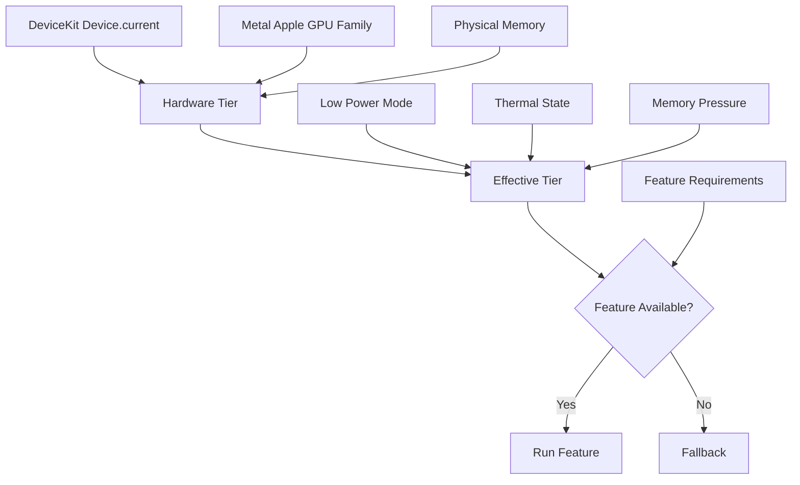
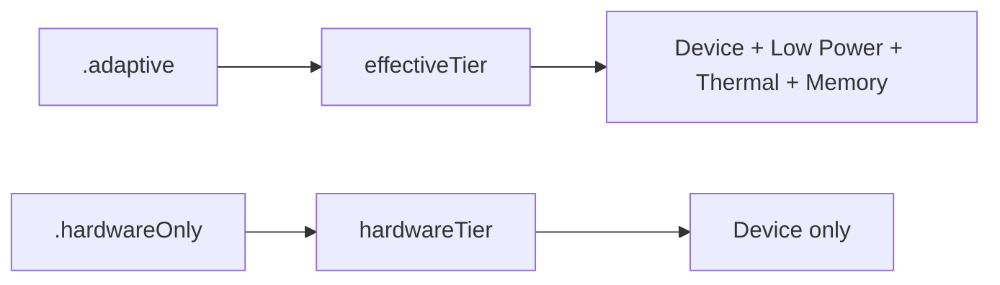

# Headroom


**Adaptive performance availability for iOS.**

Headroom helps you decide whether a feature has enough **device + runtime headroom** to run well.

```swift
import Headroom

// “This feature is fine on an iPhone 13 or better.”
if Headroom.isAvailable(.iPhone13) {
    enableRealtimeBlur()
} else {
    useStaticBackground()
}
```

Headroom is like a runtime companion to `#available`:

| Question | Tool |
| --- | --- |
| “Is this OS API available?” | `#available(iOS 17, *)` |
| “Can this device run this feature well right now?” | `Headroom.isAvailable(.iPhone13)` |

---

## At a glance

- **DeviceKit-style API**: `.iPhone13`, `.iPhone15Pro`, `.iPadPro11M4`
- **Adaptive by default**: Low Power Mode, thermal state, and memory pressure can lower availability
- **Simple tiers**: `.low`, `.medium`, `.high`, `.ultra`
- **Feature gates**: combine device baseline, memory, storage, thermal, and Low Power Mode
- **Resource readings**: memory, storage, thermal state
- **No startup benchmark**: deterministic, lightweight, and explainable

---

## Installation

```swift
.package(url: "https://github.com/NuPlay/Headroom.git", from: "0.1.0")
```

Requirements:

- iOS 13+
- Swift Package Manager
- [DeviceKit](https://github.com/devicekit/DeviceKit) 5.8.0+

> DeviceKit 5.8.0 currently requires iOS 13+ through SwiftPM, so Headroom follows that minimum.

---

## Why?

Modern iOS apps often ship one codebase across many conditions:

- older iPhones with limited memory,
- Pro devices with stronger GPU/CPU headroom,
- iPads with large memory pools,
- Low Power Mode,
- thermal pressure,
- low remaining storage.

Without Headroom, feature decisions often spread across product code:

```swift
if device == .iPhoneSE || processInfo.isLowPowerModeEnabled || thermalState == .serious {
    useFallback()
} else {
    runExpensiveFeature()
}
```

Headroom turns that into a readable product decision:

```swift
if Headroom.isAvailable(.iPhone13) {
    runExpensiveFeature()
} else {
    useFallback()
}
```

---

## How it works



Headroom separates two ideas:

| API | Meaning |
| --- | --- |
| `hardwareTier` | Baseline capability of the hardware |
| `effectiveTier` | Hardware tier adjusted by runtime pressure |

```swift
let hardware = Headroom.hardwareTier
let current = Headroom.effectiveTier
```

Example:

```swift
// A recent Pro device can have strong hardware but reduced runtime headroom.
// hardwareTier  = .ultra
// effectiveTier = .medium  // Low Power Mode, heat, or memory pressure
```

---

## Availability modes

By default, Headroom uses **adaptive** availability.

```swift
Headroom.isAvailable(.iPhone13)
```

That means runtime pressure can cause fallback even on good hardware.

Use `hardwareOnly` when you only care about the device class:

```swift
Headroom.isAvailable(.iPhone13, mode: .hardwareOnly)
```



---

## API cheatsheet

| Use case | API |
| --- | --- |
| “iPhone 13 or better, considering runtime pressure” | `Headroom.isAvailable(.iPhone13)` |
| “iPhone 13 or better, hardware only” | `Headroom.isAvailable(.iPhone13, mode: .hardwareOnly)` |
| Current effective tier | `Headroom.effectiveTier` |
| Current hardware tier | `Headroom.hardwareTier` |
| Memory pressure | `Headroom.memoryPressure` |
| Storage space | `Headroom.storage` |
| Thermal state | `Headroom.thermalState` |
| Detailed diagnostic snapshot | `Headroom.snapshot` |
| Detailed feature result | `Headroom.availability(of:)` |

---

## Tiers

| Tier | Suggested meaning |
| --- | --- |
| `.low` | Conservative UI, avoid expensive realtime work |
| `.medium` | Default experience, lightweight effects |
| `.high` | Rich animations, heavier UI/media work |
| `.ultra` | Premium paths for recent high-end hardware |

These are intentionally coarse. Headroom is designed for product decisions, not micro-benchmarking.

---

## Feature gates

For most code paths, this is enough:

```swift
if Headroom.isAvailable(.iPhone13) {
    enableRealtimeBlur()
} else {
    useStaticBackground()
}
```

For expensive features, define a feature gate:

```swift
let realtimeBlur = HeadroomFeature(
    .iPhone13,
    minimumAvailableMemoryBytes: 300 * 1_048_576,
    allowsLowPowerMode: false,
    maximumThermalState: .fair
)

if Headroom.isAvailable(realtimeBlur) {
    enableRealtimeBlur()
} else {
    useStaticBackground()
}
```

Need to debug why it failed?

```swift
let result = Headroom.availability(of: realtimeBlur)

if !result.isAvailable {
    print(result.failures)
}
```

Failure reasons can include:

- tier is too low,
- Low Power Mode is enabled,
- thermal state is too high,
- available memory is too low,
- available storage is too low.

---

## Resources

Headroom also exposes lightweight resource snapshots.

### Memory

```swift
let memory = Headroom.memory

memory.physicalBytes
memory.availableBytes
memory.usedBytes
memory.availableRatio
memory.usedRatio
```

```swift
switch Headroom.memoryPressure {
case .nominal:
    break
case .constrained:
    reduceCacheSize()
case .critical:
    releaseNonEssentialResources()
case .unknown:
    break
}
```

### Storage

```swift
let storage = Headroom.storage

storage.totalCapacityBytes
storage.availableCapacityBytes
storage.importantAvailableCapacityBytes
storage.opportunisticAvailableCapacityBytes

if storage.canFit(bytes: 500_000_000, usage: .important) {
    startDownload()
}
```

| Usage | Meaning |
| --- | --- |
| `.regular` | General available-capacity reading |
| `.important` | User-requested or important app work |
| `.opportunistic` | Cache, prefetch, optional downloads |

### Thermal

```swift
let state = Headroom.thermalState

state.isPerformanceConstrained
Headroom.isThermallyConstrained
```

> iOS public API exposes `ProcessInfo.ThermalState`, not actual device temperature in Celsius. Headroom intentionally exposes thermal state only.

### Everything at once

```swift
let resources = Headroom.resources

resources.memory.availableBytes
resources.memoryPressure
resources.storage.importantAvailableCapacityBytes
resources.thermalState
```

---

## Snapshot

Use `snapshot` when you want the decision and the signals behind it.

```swift
let snapshot = Headroom.snapshot

snapshot.hardwareTier
snapshot.effectiveTier
snapshot.signals.deviceDescription
snapshot.signals.lowPowerModeEnabled
snapshot.signals.thermalState
snapshot.signals.memoryPressure
snapshot.signals.metalAppleGPUFamily
```

---

## Customization

Most customization should stay simple: choose a DeviceKit reference device.

```swift
Headroom.isAvailable(.iPhone13)
Headroom.isAvailable(.iPhone15Pro)
Headroom.isAvailable(.iPadPro11M4)
```

If Headroom's built-in tier does not match your app's needs, override a DeviceKit case:

```swift
Headroom.configure {
    $0.overrideDevice(.iPhone15Pro, as: .ultra)
    $0.overrideDevice(.iPadPro11M4, as: .ultra)
}
```

Advanced policy tuning is available, but should be rare:

```swift
Headroom.configure {
    $0.lowPowerModeCap = .medium
    $0.fairThermalCap = .medium
    $0.seriousThermalDowngrade = 2

    $0.memoryPressurePolicy = .init(
        constrainedAvailableRatio: 0.15,
        criticalAvailableRatio: 0.07,
        constrainedAvailableBytes: 768 * 1_048_576,
        criticalAvailableBytes: 256 * 1_048_576
    )
}
```

Debug override:

```swift
#if DEBUG
Headroom.configure {
    $0.forcedEffectiveTier = .low
}
#endif
```

Reset:

```swift
Headroom.resetConfiguration()
```

---

## Design notes

Headroom uses a layered strategy:

1. DeviceKit device identity and CPU information.
2. Machine identifier fallback for unknown devices.
3. Metal Apple GPU family fallback for newer devices.
4. Physical memory as a fallback signal.
5. Runtime modifiers: Low Power Mode, thermal state, memory pressure.
6. Optional app overrides.

Headroom does **not** run synthetic benchmarks at startup. Benchmarks can be noisy, slow, battery-intensive, and affected by the thermal conditions they are trying to measure.

---

## Limitations

- Headroom does not replace `#available`. You still need OS availability checks for OS APIs.
- Headroom does not expose actual iPhone temperature in Celsius because public iOS API does not provide it.
- Tiers are coarse by design and should be calibrated to your app's feature set.
- Built-in mapping is intentionally conservative; use overrides when your app needs stricter or looser behavior.

---

## License

Headroom is available under the MIT license. See [LICENSE](LICENSE).
