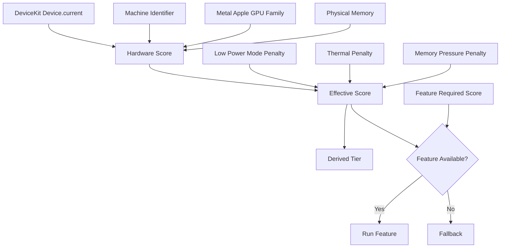
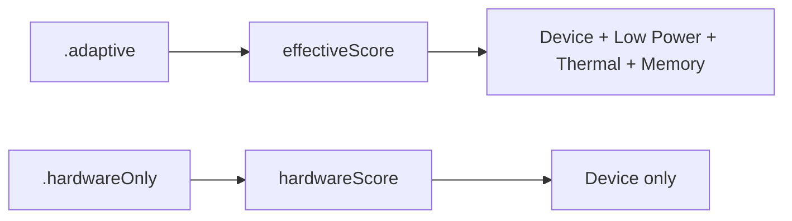

# Headroom


**Adaptive performance availability for iOS.**

Headroom helps you decide whether a feature has enough **device + runtime headroom** to run well.

```swift
import Headroom

// “This feature is fine on an iPhone 13 or better.”
if Headroom.isAvailable(.iPhone13) {
    enableRealtimeBlur()
} else {
    useStaticBackground()
}
```

Headroom is like a runtime companion to `#available`:

| Question | Tool |
| --- | --- |
| “Is this OS API available?” | `#available(iOS 17, *)` |
| “Can this device run this feature well right now?” | `Headroom.isAvailable(.iPhone13)` |

---

## At a glance

- **DeviceKit-style API**: `.iPhone13`, `.iPhone15Pro`, `.iPadPro11M4`
- **Score-based decisions**: device baselines are normalized to `0...100`
- **Adaptive by default**: Low Power Mode, thermal state, and memory pressure subtract from the score
- **Simple tiers**: `.low`, `.medium`, `.high`, `.ultra` are derived from scores
- **Feature gates**: combine device baseline, memory, storage, thermal, and Low Power Mode
- **Resource readings**: memory, storage, thermal state
- **No startup benchmark**: deterministic, lightweight, and explainable

---

## Installation

```swift
.package(url: "https://github.com/NuPlay/Headroom.git", from: "0.1.0")
```

Requirements:

- iOS 13+
- Swift Package Manager
- [DeviceKit](https://github.com/devicekit/DeviceKit) 5.8.0+

> DeviceKit 5.8.0 currently requires iOS 13+ through SwiftPM, so Headroom follows that minimum.

### Project resources

- [DocC overview](Sources/Headroom/Headroom.docc/Headroom.md)
- [Examples](Examples/README.md)
- [Sample app](Examples/SampleApp/README.md)
- [Troubleshooting](Examples/Troubleshooting.md)
- [Changelog](CHANGELOG.md)
- [Contributing guide](CONTRIBUTING.md)

### Privacy manifest

Headroom ships a `PrivacyInfo.xcprivacy` manifest. The library does not collect data, does not track users, and does not contact tracking domains. It declares disk-space required-reason API usage with reason `E174.1` because `Headroom.storage` and feature gates can check whether there is enough local space before user-visible work such as downloads, caches, or media processing.

### Testing

Run the package tests with SwiftPM:

```sh
swift test
```

---

## Why?

Modern iOS apps often ship one codebase across many conditions:

- older iPhones with limited memory,
- Pro devices with stronger GPU/CPU headroom,
- iPads with large memory pools,
- Low Power Mode,
- thermal pressure,
- low remaining storage.

Without Headroom, feature decisions often spread across product code:

```swift
if device == .iPhoneSE || processInfo.isLowPowerModeEnabled || thermalState == .serious {
    useFallback()
} else {
    runExpensiveFeature()
}
```

Headroom turns that into a readable product decision:

```swift
if Headroom.isAvailable(.iPhone13) {
    runExpensiveFeature()
} else {
    useFallback()
}
```

---

## How it works



Headroom separates two ideas:

| API | Meaning |
| --- | --- |
| `hardwareScore` | Baseline capability of the hardware, normalized to `0...100` |
| `effectiveScore` | Hardware score after runtime pressure penalties |
| `hardwareTier` | Coarse tier derived from `hardwareScore` |
| `effectiveTier` | Coarse tier derived from `effectiveScore` |

```swift
let hardwareScore = Headroom.hardwareScore
let currentScore = Headroom.effectiveScore

let hardwareTier = Headroom.hardwareTier
let currentTier = Headroom.effectiveTier
```

Example:

```swift
// A recent Pro device can have strong hardware but reduced runtime headroom.
// hardwareScore  = 84       // iPhone 15 Pro-class
// effectiveScore = 76       // e.g. Low Power Mode
// iPhone13       = 71       // reference-device requirement
// result         = pass
```

Runtime pressure is applied as a **score penalty**, not a fixed cap.
That means a recent Pro device can still satisfy an iPhone 13-class requirement under a single pressure signal, while multiple pressure signals can still push it into fallback.

---

## Score and tier model

Headroom's public API stays simple, but internally it compares scores.

| Score | Tier | Suggested meaning |
| ---: | --- | --- |
| `0...39` | `.low` | Conservative UI, avoid expensive realtime work |
| `40...69` | `.medium` | Default experience, lightweight effects |
| `70...81` | `.high` | Rich animations, heavier UI/media work |
| `82...100` | `.ultra` | Premium paths for recent high-end hardware |

Approximate built-in reference scores:

| Reference device | Approx. score | Tier |
| --- | ---: | --- |
| `iPhone 11` | `60` | `.medium` |
| `iPhone 12` | `66` | `.medium` |
| `iPhone 13` | `71` | `.high` |
| `iPhone 14 Pro` / `iPhone 15` | `79` | `.high` |
| `iPhone 15 Pro` | `84` | `.ultra` |
| `iPhone 16 Pro` | `92` | `.ultra` |

These values are heuristic, seeded from public Geekbench 6 trends and kept intentionally rounded so product logic remains understandable.

### Runtime penalties

Default adaptive penalties:

| Signal | Default behavior |
| --- | ---: |
| Low Power Mode | `-8` |
| Thermal `.fair` | `0` |
| Thermal `.serious` | `-10` |
| Thermal `.critical` | cap near `25` |
| Memory `.constrained` | `-8` |
| Memory `.critical` | `-18` |

Why is Low Power Mode only `-8` by default? Because it is not always purely bad for a UI feature: on ProMotion devices Apple also limits refresh rate to 60 Hz, which can halve the frame-rate target for animation-heavy paths. CPU/GPU-heavy features should still use `allowsLowPowerMode: false` or increase `lowPowerModePenalty`.

### Calibration notes

Headroom's default table is not a raw Geekbench score table. It is a rounded product heuristic seeded from public benchmark trends.

| Device / mode | Geekbench 6 single | Geekbench 6 multi | Geekbench 6 Metal | Headroom score |
| --- | ---: | ---: | ---: | ---: |
| [iPhone 13](https://browser.geekbench.com/ios_devices/iphone-13) | `2215` | `5236` | `17767` | `71` |
| [iPhone 15 Pro](https://browser.geekbench.com/ios_devices/iphone-15-pro) | `2883` | `7203` | `27052` | `84` |
| [iPhone 15 Pro, Low Power Mode](https://browser.geekbench.com/v6/cpu/12052842) | `1174` | `3790` | — | runtime penalty, not a separate device score |

The Low Power Mode benchmark above is roughly **41% of normal single-core** and **53% of normal multi-core** for that sample. Headroom still keeps the default penalty modest because Apple also [limits ProMotion refresh rate to 60 Hz in Low Power Mode](https://support.apple.com/en-us/101604), changing the target for many UI workloads.

---

## Availability modes

By default, Headroom uses **adaptive** availability.

```swift
Headroom.isAvailable(.iPhone13)
Headroom.isAvailable(.high)
```

That means runtime pressure can cause fallback even on good hardware. The penalty is score-based, so an iPhone 15 Pro-class device can often still satisfy an iPhone 13-class feature under one pressure signal.

Use `hardwareOnly` when you only care about the device class:

```swift
Headroom.isAvailable(.iPhone13, mode: .hardwareOnly)
Headroom.isAvailable(.high, mode: .hardwareOnly)

let hardwareScore = Headroom.score(for: .hardwareOnly)
let hardwareTier = Headroom.tier(for: .hardwareOnly)
```



---

## API cheatsheet

| Use case | API |
| --- | --- |
| “iPhone 13 or better, considering runtime pressure” | `Headroom.isAvailable(.iPhone13)` |
| “iPhone 13 or better, hardware only” | `Headroom.isAvailable(.iPhone13, mode: .hardwareOnly)` |
| “High tier or better, hardware only” | `Headroom.isAvailable(.high, mode: .hardwareOnly)` |
| Current score for a mode | `Headroom.score(for: .adaptive)` / `Headroom.score(for: .hardwareOnly)` |
| Current tier for a mode | `Headroom.tier(for: .adaptive)` / `Headroom.tier(for: .hardwareOnly)` |
| Current effective score | `Headroom.effectiveScore` |
| Current hardware score | `Headroom.hardwareScore` |
| Current effective tier | `Headroom.effectiveTier` |
| Current hardware tier | `Headroom.hardwareTier` |
| Memory pressure | `Headroom.memoryPressure` |
| Storage space | `Headroom.storage` |
| Thermal state | `Headroom.thermalState` |
| Detailed diagnostic snapshot | `Headroom.snapshot` |
| Detailed feature result | `Headroom.availability(of:)` |
| Evaluate a saved snapshot/resources pair | `Headroom.availability(of:snapshot:resources:)` |
| Reproducible feature diagnostic report | `Headroom.diagnosticReport(of:)` |
| Diagnostic report schema version | `report.schemaVersion` / `HeadroomFeatureDiagnosticReport.currentSchemaVersion` |
| Check decoded support artifact consistency | `report.isReplayConsistent` |
| Typed byte counts | `HeadroomByteCount.mebibytes(300)` / `.gibibytes(2)` |

---

## Tiers

Tiers are still useful when you do not care about exact scores:

```swift
if Headroom.isAvailable(.high) {
    enableRichEffects()
}
```

Internally, this is equivalent to checking the tier's minimum score.

```swift
Headroom.Tier.high.minimumScore // 70
```

Tiers are intentionally coarse. Scores give Headroom smoother behavior; tiers keep product code readable.

---

## Feature gates

For most code paths, this is enough:

```swift
if Headroom.isAvailable(.iPhone13) {
    enableRealtimeBlur()
} else {
    useStaticBackground()
}
```

For expensive features, define a feature gate:

```swift
let realtimeBlur = HeadroomFeature(
    .iPhone13,
    resources: .init(
        memory: .mebibytes(300),
        storage: .gibibytes(2)
    ),
    allowsLowPowerMode: false,
    maximumThermalState: .fair
)

if Headroom.isAvailable(realtimeBlur) {
    enableRealtimeBlur()
} else {
    useStaticBackground()
}
```

Need to debug why it failed?

```swift
let result = Headroom.availability(of: realtimeBlur)

if !result.isAvailable {
    print(result.failureCodes)       // ["score", "lowPowerMode", ...]
    print(result.diagnosticSummary)
    result.recoverySuggestions.forEach { print("• \($0)") }
}

let report = Headroom.diagnosticReport(of: realtimeBlur)
let data = try JSONEncoder().encode(report)
```

Need deterministic tests or QA replay? Evaluate a feature against saved diagnostics without reading live device state:

```swift
let result = Headroom.availability(
    of: realtimeBlur,
    snapshot: savedSnapshot,
    resources: savedResources
)
```

Failure reasons can include:

- score is too low,
- Low Power Mode is enabled,
- thermal state is too high,
- available memory is too low,
- available storage is too low.

Use `failureKinds`, `failureCodes`, `contains(_:)`, or `failures(of:)` when product logic or QA tooling needs stable machine-readable categories instead of display text.

`HeadroomFeatureAvailability`, `HeadroomAvailabilityFailure`, snapshots, resources, configuration, and feature definitions are `Codable`, so you can persist QA fixtures or send structured diagnostics to your own logging pipeline.

For support tickets or QA replay, `HeadroomFeatureDiagnosticReport` bundles the feature, snapshot, resources, schema version, and availability result into one `Codable` value. Failure JSON uses a stable tagged shape with a `kind` field, so support tooling can inspect failure records without parsing display strings.

When decoding a report from a log or support ticket, use `report.isCurrentSchemaVersion` to identify legacy artifacts and `report.isReplayConsistent` to confirm the embedded availability result still matches a fresh replay from the report's feature, snapshot, and resources.

---

## Resources

Headroom also exposes lightweight resource snapshots.

### Memory

```swift
let memory = Headroom.memory

memory.physicalBytes
memory.availableBytes
memory.usedBytes
memory.availableRatio
memory.usedRatio
```

```swift
switch Headroom.memoryPressure {
case .nominal:
    break
case .constrained:
    reduceCacheSize()
case .critical:
    releaseNonEssentialResources()
case .unknown:
    break
}
```

### Storage

```swift
let storage = Headroom.storage

storage.totalCapacityBytes
storage.availableCapacityBytes
storage.importantAvailableCapacityBytes
storage.opportunisticAvailableCapacityBytes

if storage.canFit(bytes: 500_000_000, usage: .important) {
    startDownload()
}

if storage.canFit(.megabytes(500), usage: .important) {
    startDownload()
}
```

| Usage | Meaning |
| --- | --- |
| `.regular` | General available-capacity reading |
| `.important` | User-requested or important app work |
| `.opportunistic` | Cache, prefetch, optional downloads |

### Thermal

```swift
let state = Headroom.thermalState

state.isPerformanceConstrained
Headroom.isThermallyConstrained
```

> iOS public API exposes `ProcessInfo.ThermalState`, not actual device temperature in Celsius. Headroom intentionally exposes thermal state only.

### Everything at once

```swift
let resources = Headroom.resources

resources.memory.availableBytes
resources.memoryPressure
resources.storage.importantAvailableCapacityBytes
resources.thermalState
```

---

## Snapshot

Use `snapshot` when you want the decision and the signals behind it.

```swift
let snapshot = Headroom.snapshot

snapshot.hardwareScore
snapshot.effectiveScore
snapshot.hardwareTier
snapshot.effectiveTier
snapshot.signals.deviceDescription
snapshot.signals.lowPowerModeEnabled
snapshot.signals.thermalState
snapshot.signals.memoryPressure
snapshot.signals.metalAppleGPUFamily
```

---

## Customization

Most customization should stay simple: choose a DeviceKit reference device.

```swift
Headroom.isAvailable(.iPhone13)
Headroom.isAvailable(.iPhone15Pro)
Headroom.isAvailable(.iPadPro11M4)
```

If Headroom's built-in score does not match your app's needs, override a DeviceKit case:

```swift
Headroom.configure {
    $0.overrideDevice(.iPhone15Pro, as: 86)
    $0.overrideDevice(.iPadPro11M4, as: 96)
}
```

You can still override by tier if you want a coarse value:

```swift
Headroom.configure {
    $0.overrideDevice(.iPhone15Pro, as: .ultra)
}
```

Advanced policy tuning is available, but should be rare:

```swift
Headroom.configure {
    $0.lowPowerModePenalty = 8
    $0.fairThermalPenalty = 0
    $0.seriousThermalPenalty = 12
    $0.criticalThermalScore = 20

    $0.memoryPressurePolicy = .init(
        constrainedAvailableRatio: 0.15,
        criticalAvailableRatio: 0.07,
        constrainedAvailableBytes: 768 * 1_048_576,
        criticalAvailableBytes: 256 * 1_048_576
    )
}
```

Debug override:

```swift
#if DEBUG
Headroom.configure {
    $0.forcedEffectiveScore = 35
}
#endif
```

Reset:

```swift
Headroom.resetConfiguration()
```

---

## Design notes

Headroom uses a layered strategy:

1. DeviceKit device identity and CPU information.
2. Machine identifier fallback for unknown devices.
3. Metal Apple GPU family fallback for newer devices.
4. Physical memory as a fallback signal.
5. Runtime penalties: Low Power Mode, thermal state, memory pressure.
6. Optional app overrides.

Headroom does **not** run synthetic benchmarks at startup. Benchmarks can be noisy, slow, battery-intensive, and affected by the thermal conditions they are trying to measure. The built-in table is deterministic and rounded; tune it for your app if you have better local data.

---

## Limitations

- Headroom does not replace `#available`. You still need OS availability checks for OS APIs.
- Headroom does not expose actual iPhone temperature in Celsius because public iOS API does not provide it.
- Scores and tiers are heuristics and should be calibrated to your app's feature set.
- Built-in mapping is intentionally conservative and rounded; use overrides when your app needs stricter or looser behavior.

---

## License

Headroom is available under the MIT license. See [LICENSE](LICENSE).
